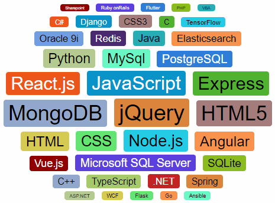

# jquery.tagcloud v1.2.0

Tag cloud plugin for jQuery, showing bigger tags in the center.



## Usage

There are two ways to define a tag cloud:

1. Use `ul` and `li` HTML tags
2. Use a configuration object and a `div` HTML tag

### 1. Use `ul` and `li` HTML tags

```
<script src="https://code.jquery.com/jquery-latest.js" type="text/javascript" charset="utf-8"></script>
<script src="/path/to/jquery.tagcloud.js" type="text/javascript" charset="utf-8"></script>

<ul id="tagCloud1">
  <li data-weight="60"><a href="#">HTML</a></li> <!-- with link -->
  <li data-weight="65">CSS</li> <!-- without link -->
  <li data-weight="85">JavaScript</li>
  <!-- etc... -->
</ul>

<script>
$(document).ready(function() {
  $('#tagCloud1').tagCloud();
});
</script>
```

Add a `data-weight` attribute to the `li` tag or the `a` tag to indicate the weight. The weight determins the size of the font used in the tag cloud.

Customize the tag cloud with a configuration object, see configuration.

### 2. Use an configuration object and a `div` HTML tag

```
<div id="tagCloud2"></div>

<script>
$(document).ready(function() {
  $('#tagCloud2').tagCloud({
    data: [
      { tag: 'HTML',       weight: 60 },
      { tag: 'CSS',        weight: 65,
        link: 'https://en.wikipedia.org/wiki/CSS'
        tooltip: 'Cascading Style Sheets' },
      { tag: 'JavaScript', weight: 85 },
      // etc...
    ]
  });
});
</script>
```

Add a `data` key to the configuration object containing an array of objects, where each object has two required keys:

- `tag`: Tag name
- `weight`: Weight, determining the size of the font used in the tag cloud

See additional options in the configuration

## Configuration

Pass a configuration object to `.tagCloud()`:

```
{
  container: {  // all keys are optional, default as indicated
    width:            500,        // tag cloud width
    height:           'auto',     // tag cloud height
    padding:          '10px 5px', // padding
    backgroundColor:  '#f0f0f0'   // background color
    fontFamily:       '"Helvetica Neue",Helvetica,Arial,sans-serif', // font family
    // add additional styles as desired
  },
  tag: {        // all keys are optional, default as indicated
    margin:           '3px 7px',  // tag margin
    padding:          '3px 10px', // tag padding
    borderRadius:     '5px',      // border radius
    color:            'auto',     // automatic text color, black for light background,
                                  //   and white for dark background
    backgroundColor:  '#ff9655',  // background color,  default is one out of many
    minFontSize:      10,         // minimum font size in pixels
    maxFontSize:      45,         // maximum font size in pixels
    format:         '{tag.name}', // tag format, use HTML with tokens:
                                  //   {tag.name}: tag name
                                  //   {tag.link}: tag link
                                  //   {tag.weight}: weight
                                  //   {tag.weight.0}: rounded weight
                                  //   {tag.weight.2}: weight rounded to 2 decimal places
                                  //   {tag.percent}: percent weight to sum of all weights
                                  //   {tag.percent.1}: percentage rounded to 1 decimal
    textShadow:       false       // text shadow, enable for better visibility
  },
  data: [       // required if div tag is used
    {
      tag:            'GitHub',   // tag name, may include HTML, required
      link:           'https://github.com', // link, optional
      tooltip:        'Message',  // tooltip, optional
      weight:         60,         // weight, required
      color:           '#ffffff'  // text color, optional
      backgroundColor: '#db843d'  // background color, optional (short: bgColor)
    },
    // etc...
  ]
}
```

The tag with the smallest weight will use the font defined by `minFontSize`, the one with the biggest weight will use `maxFontSize`.

## Demo

See [demo.html](https://peterthoeny.github.io/jquery.tagcloud/demo.html)
